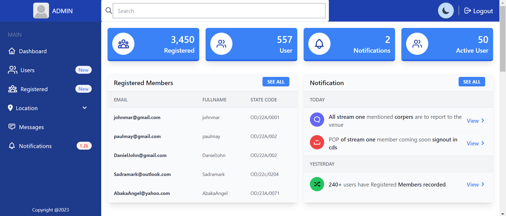
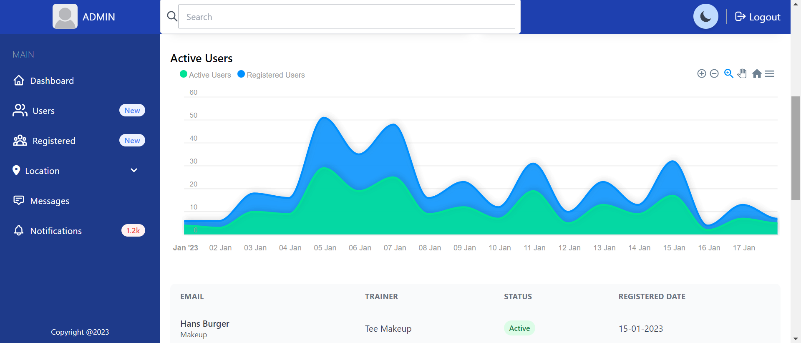
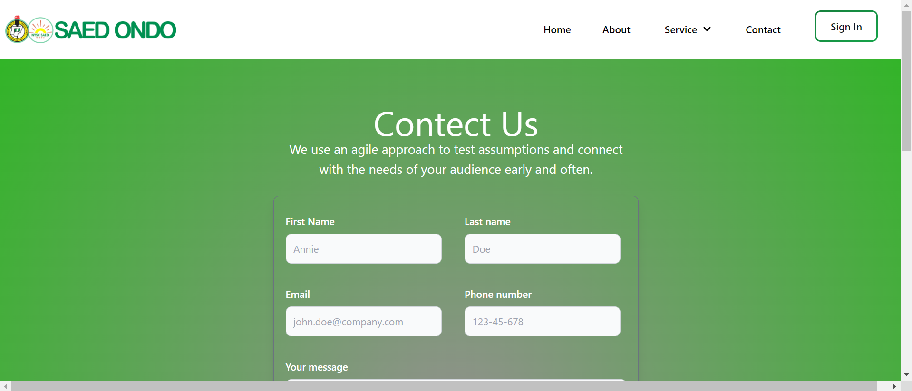
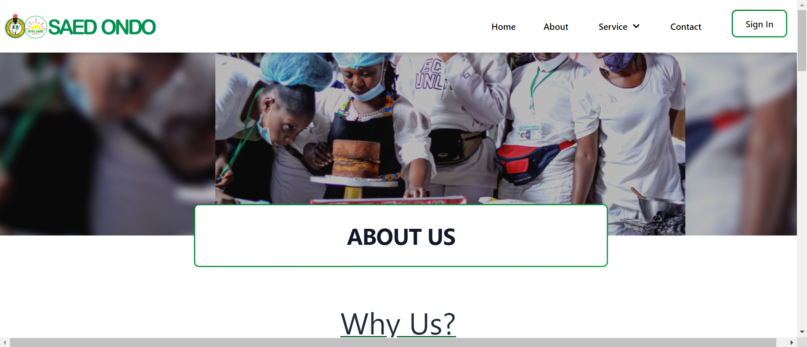

## Welcome to Saedondo.
Saedondo is a website designed to help young National Youth Service Corps (NYSC) candidates in Ondo State, Nigeria grow their skills in areas such as makeup artistry, shoemaking, and information and communication technology (ICT).

## Technology used for build
HTML, 
Tailwind, 
Node, 
Mongo, 
and Express.
Saedondo was built using a combination of HTML, Tailwind, Node, Mongo, and Express. HTML is a markup language used for structuring and formatting content on the web. Tailwind is a CSS framework that provides a set of utility classes for quickly styling elements. Node is a JavaScript runtime built on Chrome's V8 JavaScript engine. Mongo is a database management system that uses a document-oriented model. Finally, Express is a web application framework for Node.js. Together, these technologies allow Saedondo to provide a smooth and user-friendly experience for its users.

## Skills Training
Saedondo offers skills training in a variety of fields, including makeup artistry, shoemaking, and ICT. These courses are designed to help NYSC candidates build their knowledge and expertise, making them more competitive in the job market.

## Dashboard
The dashboard on Saedondo is only accessible to the administrator and allows them to view the students who have registered for training in various local government areas in Ondo State. The dashboard also displays the dates that each student began their training with the chosen company. This information is useful for tracking the progress of students and ensuring that they are receiving the support and guidance they need.

## User Registration
In order to access the skills training courses and other features on Saedondo, users must first create an account. This involves providing some basic personal information and creating a unique username and password. Once registered, users can log in to their account at any time to access the training materials and track their progress.

## Customized Training Plans
At Saedondo, we recognize that every learner is different and has unique needs and goals. To help our users achieve success, we offer customizable training plans that allow them to focus on the areas that are most relevant to their needs and interests.

## Support and Assistance
Saedondo is committed to providing its users with the support and assistance they need to succeed. If users have any questions or need help with any aspect of the training process, they can contact the Saedondo team for assistance. The team is dedicated to ensuring that all users have a positive and productive learning experience.

## Certification
Upon completion of a skills training course on Saedondo, users may be eligible to receive a certificate of completion. This certificate serves as recognition of the user's dedication to learning and can be a valuable addition to their resume or portfolio.
## Community
In addition to the skills training courses, Saedondo also offers a community forum where users can connect with one another, share their experiences, and get advice and support. This forum is a great way for users to build relationships and stay motivated as they work towards their goals.

## Mobile Compatibility
Saedondo is designed to be fully mobile compatible, allowing users to access the website and complete their training from any device with an internet connection. This means that users can learn on the go, at their own convenience, without the need for a desktop or laptop computer.

[mobile view page](./img/mobile1.png)

## Security
At Saedondo, we take the security of our users' personal information and data very seriously. We use industry-standard encryption to protect all transmitted data and have implemented strict security measures to prevent unauthorized access to our systems. We also regularly review and update our security protocols to ensure that our users' data remains safe and secure.

##Ongoing Support and Development
Saedondo is committed to providing its users with the best possible learning experience. To achieve this, we are constantly updating and improving our website and training materials. We also offer ongoing support to our users to ensure that they have the resources and guidance they need to succeed.